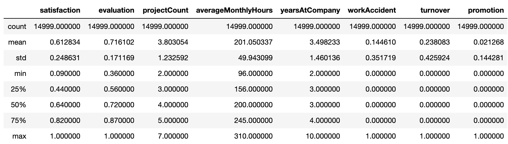
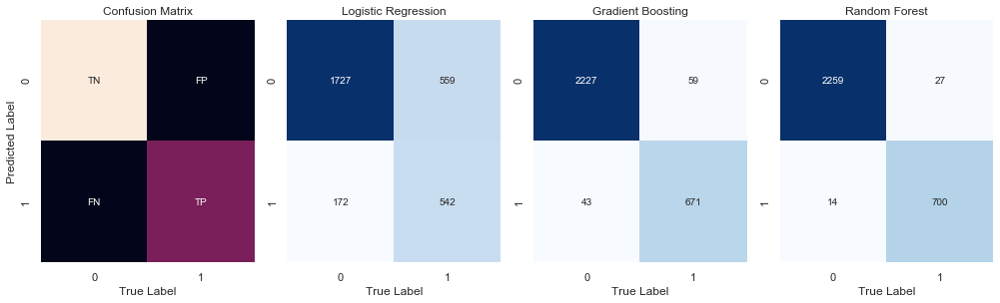

# Understanding and Predicting Employee Turnover

### Objective: 
The goal of this project is 
- To understand what factor contributed most to employee turnover
- To perform clustering to find any meaning patterns of employee traits
- To create a model that predicts the likelihood if a certain employee will leave the company or not
- To create or improve different retention strategies on targeted employees

The implementation of this model allows management to create better decision-making actions

### The Problem
One of the most common problems at work is **Turnover**. Replacing a worker earning about **50,000 dollars** cost the company about **10,000 dollars** or 20% of that worker's yearly income accoording to the Center of American Progress.

Replacing a high-level employee can cost multiple of that 

**Cost include:**

- Cost of off-boarding
- Cost of hiring (advertising, interviewing, hiring)
- Cost of onboarding a new person (training, management time)
- Lost productivity (a new person may take 1-2 years to reach the productivity of an existing person)

**Annual Cost of Turnover** = (Hiring + Onboarding + Development + Unfilled Time) * (Number of Employee X Annual Turnover Percentage)

**Annual Cost of Turnover** = (1000 + 500) X (15,000 * 24%)

**Annual Cost of Turnover** = 1500 X 3600

**Annual Cost of Turnover** = 5400000 

### Introduction: 
The data set use for this project contains employee's satisfaction, evaluation, projectCount, averageMonthlyHours, the number of years the employee provide service,  whether employee had any accident, turnover, promotion (0 represents "yes" and 1 respresents "no"),. The dataset also represent the deparment of the employee and their salary category (low, medium, high). The first five rows of the dataset are illustrated below. 

### Data Quality Check: 

The figure below shows whether the data has any missing values.

Some basic information regarding the dataset is shown below.

Next, we look at the statistical information about the dataset before diving deep into exploratory analysis.

### Exploratory Data Analysis: 
Display the mean summary of Employees (Turnover Vs. Non-turnover). What do we notice between groups?

**Observation** : We notice that people who left the company has approximately **44%** satisfaction while people who stayed has **66%** satisfication on average. Next we look at the corrolation map where we find that the lowest satisfcation leads to the higher turnover. 

### Distribution of Satisfaction, Evaluation and Project Count

**Summary:** 

**Satisfaction vs Employee Count:** There is a bimodal distribution. From our sample data, we have employee who are really dissatified indicating satifaction rate of **.2** whereas we also have employees who are really happy  and has satisfaction rate **(0.6~1)**.

**Evaluation vs Employee Count:** We see a clear separation in regards to employee being evaluated. We have people 
**<.6** and also people who belong **0.7~0.8**. It indicates that half employee are sad and the other half are really enjoying working at this company.

**Average Monthly Hours vs. Employee Count:** There are employees who works less than 150 hours a month and more than 200 hours a month.
### Satisfaction VS. Evaulation

**Summary:**
There are **3** distinct clusters for employee who left the company.

**Cluster 1 (Hard-Working and Sad Employee):** Satisfaction was below 0.2 and evaluations were greater than 0.75 which could be a good indication that employees who left the company were good workers but felt horrible at the job.

- **Question** What could be the reason for feeling so horrible when you are highly evaluated? Could it be working too hard? Could this cluster mean employees who are "overworked"?

**Cluster 2 (Bad and Sad Employee):** Satisfaction between about 0.35~0.45 and evaluations below ~0.58. This could be seen as employees who were badly evaluated and felt bad at work.

- **Question** Could this cluster mean employees who "under-performed"?

**Cluster 3 (Hard-Working and Happy Employee):** Satisfaction between 0.7~1.0 and evaluations were greater than 0.8. Which could mean that employees in this cluster were "ideal". They loved their work and were evaluated highly for their performance. 

- **Question** Could this cluster mean that employees left beacuse they found another job opportunity 

### K-Means Clustering of Employee Turnover 

   **Cluster 1 (Blue):** Hard-working and Sad Employees

   **Cluster 2 (Red):** Bad and Sad Employee.

   **Cluster 3 (Green):** Hard-working and Happy Employee

### Employee Satisfaction

There is a **tri-modal** distribution for employees that turnovered
- Employees who had really low satisfaction level **(0.2 or less)** left the company more 
- Employees who had low satifaction levels **(0.3~0.5)** left the company more
- Employess who had really high satifaction levels **(0.7 or more)** left the company more. 

### Employee Project Count

**Summary**: 
- More than half of employees with **2, 6 and 7** projects left the company
- Majority of the employees who did not leave the company had **3,4,and 5** projects
- All of the employees with **7** projects left the company
- There is an increase in employee turnover rate as project count increases.
### Employee Department Distribuition

We notice that the sales, technical and support team has the highes turnover rate. 

### Average Monthly Hours

**Summary**: 

- A bimodal distribution for employees that turnovered
- Employees who had less hours of work **(~150 hours or less)** left the company more
- Employees who had too many hours of work **(~250 or more)** left the company
- Employees who left generarlly were **underworked** or **overworked**

### Modeling

We split data into a train and test set. We will fit our model with the train set and leave our test set for evaluation

### Resample Methods
We train a base logistic regression model on the three types of samples to see which yields  the best result

1. **Orginal Sample**
2. **Upsampling Data** Randomly resample the minority class to create new data. **SMOTE** – Use the nearest neighbors of the minority observations to create new synthetic data
3. **Downsampling Data** – Remove some sample from the majority class.

Applying 5 Fold Cross Validation using Logistic Regression, We trained on Orginal, Upsampled  and downsampled data to see which performs best. We achieve F-1 score for: 

- Original Sample: 45.01%
- Upsample: 77.91%
- SMOTE: 79.06%
- Downsample: 77.85%

There SMOTE gives the best performance. Therefore we use SMOTE to train the model using three estimators as follows:

1. **Logistic Regression**

2. **Random Forest**

3. **Gradient Boosting**

### Summary of the Model

### Understanding metrics and determine what metrics to optimize

The higher top left curve yeilds the better score – in this case the `Random Forest Classifier`. The ROC curve indicates the ratio between the **True Positive Rate** and **False Positive Rate** Therefore it is a more robust metric than accuracy. If we created a model that shows all negatives (predict all 0) we would get approximately 76% accuracy because 76% people in our data did not leave the company. Therefore, accuracy is not right metric to optimize. Thus we discuss precision and recall. 

#### Confusion Matrix (Recall or Precison)

It depends on how much cost/weight we want on the two types of errors:
1. **False Positive**
2. **False Negative**

What's the coset of having a FN and FP? 

**Optimize Recall When:**
- Want to limit **false negative**
- will get more **false positives**
- FN > FP 

**Optimize Precision When:**
- want to limit false positives
- FP > FN

In this employee turnover, which error should we weigh more? 
- We should weigh more False Negatives and optimize recall because we want to capture as many as employee possible who has high risk of leaving the company. In order to do that, we want to limit the **false negative** because it predicts the employee who will not leave the company but actually does. Limiting this scenario saves the company a great deal of money rather than focusing on the false positive. False positive (Type I error) predicts a person might leave the company and suggests to invest money into them. This type of error is significantly less costly that false negative.   

### Random Forest Feature Importance

### What to optimize
We want out machine learning model to capture as much as of the minority class as possible. In this case, turnover group. Our objective is to catch ALL of the highly probable turnover employee at rish of flaggin some low-risk non-turnover employee. 

### Conclussion

**Binary Classification:** Turnover V.S. Non Turnover
**Instance Scoring:** Likelihood of employee responding to an offer/incentive to save them from leaving.

**Need for Application** Saves employees from leaving.

In our employee retention problem, rather than simply predicting whether an employee will leave the company within a certain time frame, we would much rather have an estimate of the probability that he/she will leave the company. We would rank employee by their probability of leaving, then allocate a limited incentive budget to the highest probability instance. 

Consider employee turnover domain where an employee is given treatment by Human Resources because they think the employee will leave the company within a month but the employee actually does not. This is false positive. This mistake could be expensive, inconvenient, an time consuming for both the Human Resources and employee but is a good investment for relational growth. 

Compare this with the opposite error where Human Resources does not give treatment/incentives to the employees and they do leave. This is a false negative. This type of error is more detrimental because the company lost an employee, which could lead to great setbacks and more money to rehire. Depending on these errors, different costs are weighed based on the type of employee being treated. For example, if it's a high-salary employee then would we need a costlier form of treatment. What if it's a low-salary employee? The cost for each error is different ad should be weighed accordingly. 

**Solution 1:**

- We can rank employee by their probability of leaving, then allocate a limited incentive budget to the highest probability instances. 
- OR, we can allocated our incentive budget to the instances with the highest expected loss for which wee will need the probability of turnover. 

**Solution 2:**

- Be a good couch
- Emplower the team and do not micromanage
- Express interest for team member sucess
- Have clear vision / strategy for team
- Help teeam with career development

### Selection Bias

- One thing to note about this dataset is thee turnover feature. We do not know if the employees that left are interns, contractors, full-time or part-time. These are important variables to take into consideration when perfoming a machine learning algorithm to it. 

- Another thing to note down is the type of bias of the evaluation feature. Evaluation is heavily subjective and can vary tremendously depending on who is the evaluator. If the employee knows the evalutor then he/she will probably have a higher score. 